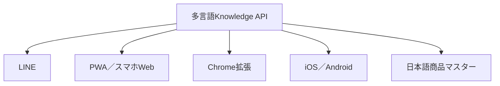

# P-GATE チャネル拡張ロードマップ v1.7以降

## 方針

LINE、Web、Chrome、iOS、Androidごとに推薦ロジックを作らない。日本語の商品マスターと多言語Knowledge APIを共通の頭脳とし、各チャネルは質問・表示・送客・KPI計測を担当する。

同じ質問・同じ契約条件なら、入口が変わっても同じ根拠とポリシーで回答する。チャネル別のKPIは`Source`で分離する。

## 実装順

| 優先 | チャネル | 役割 | MVP機能 | 着手条件 |
|---:|---|---|---|---|
| 1 | LINE | 最も手軽な利用開始 | 友だち追加、文章検索、最大3候補、Amazon送客 | v1.6実機試験 |
| 2 | PWA | iPhone／Android共通のアプリ体験 | 多言語チャット、履歴、お気に入り、ホーム画面追加 | Knowledge API公開 |
| 3 | Chrome拡張 | EC閲覧中の比較・相談 | 現在の商品ページを読み取り、横のパネルで質問・比較 | PWAの回答UX確定 |
| 4 | iOS／Android | 継続利用とストア獲得 | バーコード検索、通知、お気に入り、履歴、LINE連携 | PWAで継続率を確認 |

ネイティブ版のデータ境界と審査条件は`docs/NATIVE_APP_ARCHITECTURE_v2.0.md`を正本候補とする。

## Chrome拡張機能

Chrome Web Storeが受け付けるManifest V3で実装する。初期版は権限を`activeTab`と必要最小限の保存領域に限定し、閲覧履歴全体は取得しない。

### 利用イメージ

1. 利用者がAmazon、楽天、Yahoo!ショッピング等の商品ページを開く。
2. P-GATEアイコンを押すと右側に相談パネルが開く。
3. 商品タイトル・表示中URLを利用者の操作で取り込む。
4. 日本語・英語・中国語・韓国語・ローマ字で質問する。
5. P-GATEが根拠、代替候補、比較ポイントを表示する。
6. 送客を`Source=CHROME_EXTENSION`で計測する。

セラー管理画面へ自動操作を行う拡張ではなく、エンドユーザーの意思決定支援から開始する。サイト構造の変更や利用規約に依存する自動スクレイピングは避ける。

## PWA／スマホWeb

PWAは1つのWebコードでiPhone・Android・PCへ提供し、対応環境ではホーム画面へ追加できる。ストア審査前に実利用データを取れるため、最初のスマホ版に適する。

初期機能:

- 多言語の商品相談
- 最大3候補と根拠
- Amazon等への送客
- 質問履歴とお気に入り
- LINEから同じ質問を開くディープリンク
- チャネル別KPIと同意管理

## iOS／Android

PWAの利用実績を基に、共通コードを多く使えるクロスプラットフォーム構成で開発する。単なるWeb表示ではなく、次のアプリ固有機能を加える。

- カメラによるバーコード／商品パッケージ検索
- 値下げ、再入荷、比較結果のプッシュ通知
- お気に入りと端末間同期
- LINE、Web、アプリ間の相談履歴引継ぎ
- 日本語・英語・中国語・韓国語のUI

Apple App StoreとGoogle Playへの公開には、プライバシーポリシー、データ利用開示、審査用アカウント、ストア素材、実機テストが必要。個人の新規Google Play開発者アカウントに該当する場合、公開前のクローズドテスト要件も計画へ含める。

## 段階判定

| 判定点 | 合格基準の初期案 | 次の投資 |
|---|---|---|
| LINEパイロット | 質問50件以上、回答到達率、送客率を計測可能 | PWA |
| PWAパイロット | 100利用者以上、翌週再利用と送客を確認 | Chrome |
| 2チャネル比較 | LINE／PWA／Chromeの獲得・継続・送客単価を比較 | ネイティブアプリ |
| ストア前 | 継続利用理由と通知・カメラ需要を実測 | iOS／Android |

数値は成功を保証する目標ではなく、次の開発費を投じるか判断する最低限の検証サンプルとする。

## 公式要件

- [Chrome Extensions / Manifest V3](https://developer.chrome.com/docs/extensions/develop/migrate/what-is-mv3)
- [Chrome Extension manifest](https://developer.chrome.com/docs/extensions/reference/manifest)
- [PWAのインストール要件](https://web.dev/articles/install-criteria)
- [Apple App Review Guidelines](https://developer.apple.com/app-store/review/guidelines/)
- [Google Play審査準備](https://support.google.com/googleplay/android-developer/answer/9859455)
