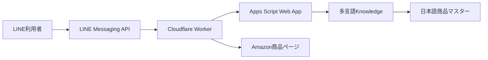

# LINE連携仕様 v1.6

## 目的

LINE公式アカウントを友だち追加した利用者が、日本語・英語・中国語・韓国語・ローマ字で欲しい商品を質問し、P-GATEの根拠付き候補をLINE内で受け取れるようにする。

## 構成

LINEのWebhook署名はHTTPヘッダーに入る。Apps Scriptの`doPost(e)`では要求ヘッダーを安全に取得できないため、LINEからGASへ直接接続しない。Cloudflare Workerが生の本文と`X-Line-Signature`をHMAC-SHA256で検証し、検証成功後だけ共有秘密でGASへ転送する。

## セキュリティ

- `LINE_CHANNEL_SECRET`と`LINE_CHANNEL_ACCESS_TOKEN`はWorkerのSecretとして保管する。
- GASにはLINEのChannel Secret / Access Tokenを保存しない。
- WorkerとGAS間は`GAS_BRIDGE_SECRET` / `LINE_BRIDGE_SECRET`で認証する。
- LINEユーザーIDと質問文はGASへ処理用として渡すが、ログにはSHA-256ハッシュだけを保存する。
- クリックURLは署名付き・7日間有効とし、Amazonの許可ドメイン以外へリダイレクトしない。
- LINEの再送は`webhookEventId`、KPIは`event_id`で重複排除する。

## 応答

- 友だち追加時は対応言語と質問例を返す。
- テキスト質問は同一の多言語Knowledge基盤で検索する。
- 説明1メッセージ＋商品最大3メッセージ、合計最大4件を返す。
- 画像等の非テキスト入力は質問方法を案内する。
- 根拠不足、契約・競合ポリシー違反時は商品を表示しない。

## KPI

LINE返信成功後に`IMPRESSION`、署名付き商品リンクの利用時に`CLICK`と`OUTBOUND`を記録する。`Campaign_ID=LINE_PILOT`、`Experiment_Variant=P_GATE`、`Source=LINE`として、契約アカウント別に集計する。

## 初期パイロットの設定

GASのScript Properties:

- `LINE_BRIDGE_SECRET`: Workerの`GAS_BRIDGE_SECRET`と同じ十分に長いランダム値
- `LINE_CONTRACT_ID`: `Client_Contracts`に登録したITGパイロット契約ID
- `LINE_DEFAULT_CATEGORY`: 初期対象カテゴリ（例: `FOOD`）

WorkerのSecrets:

- `LINE_CHANNEL_SECRET`
- `LINE_CHANNEL_ACCESS_TOKEN`
- `GAS_BACKEND_URL`
- `GAS_BRIDGE_SECRET`
- `LINK_SIGNING_SECRET`

同じWorkerでPWAを配信する場合は`TURNSTILE_SITE_KEY`と`TURNSTILE_SECRET_KEY`も設定する。PWAの詳細は`docs/PWA_SPEC_v1.7.md`を参照する。

初期版は1つのLINE公式アカウントを1契約へ接続する。複数顧客を同一アカウントで扱う場合は、商品・カテゴリと契約を明示的に結ぶルーティングを追加してから公開する。

## 公式仕様

- [LINE Webhookの受信と署名検証](https://developers.line.biz/ja/docs/messaging-api/receiving-messages/)
- [LINE Messaging APIリファレンス](https://developers.line.biz/en/reference/messaging-api/)
- [LINE Webhook URLの検証](https://developers.line.biz/en/docs/messaging-api/verify-webhook-url/)
- [Google Apps Script Web Apps](https://developers.google.com/apps-script/guides/web)
- [Cloudflare Workers料金](https://developers.cloudflare.com/workers/platform/pricing/)
- [Cloudflare Web Crypto](https://developers.cloudflare.com/workers/runtime-apis/web-crypto/)
